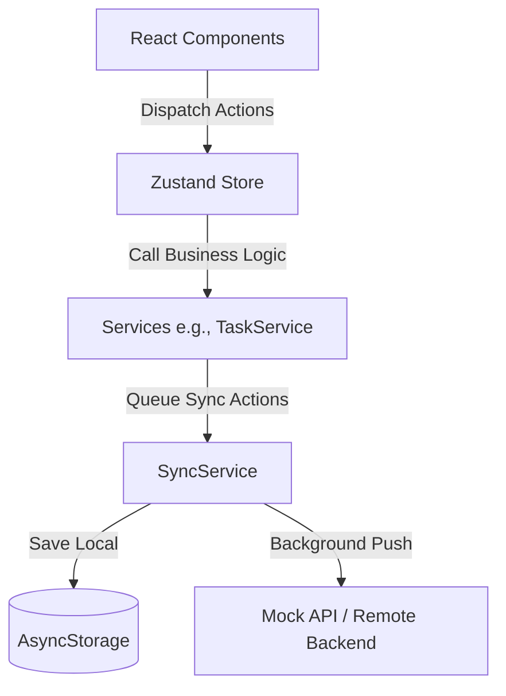

# 🏗️ Technical Architecture

NeuroPilot is built with a highly scalable, maintainable architecture designed to support a "Local-First" user experience.

---

## 🏛️ Design Pattern: Service-Repository

To prevent the state management layer (Zustand) from becoming bloated with business logic and side effects, the app uses a **Service-Repository** pattern.

### Core Layers:
1. **View Layer (React)**: Purely responsible for rendering UI based on store state and capturing user intent.
2. **State Layer (Zustand)**: Holds the "Optimistic" state for instant UI updates.
3. **Service Layer**: Contains business logic, ID generation, and side-effect management (e.g., `TaskService`, `FocusShieldService`).
4. **Data Layer (SyncService)**: Manages offline queueing, local storage persistence, and eventual consistency with the backend.

---

## 💾 Local-First & Background Sync
The app assumes the user may have intermittent connectivity. 

* **Optimistic Updates**: When a user creates a task, the UI updates *instantly*.
* **Action Queue**: The `SyncService` captures the action and saves it to a persistent local queue in `AsyncStorage`.
* **Background Processing**: A background loop attempts to process the queue against the remote API when connectivity is available.

---

## 🛠️ Technology Stack
* **Framework**: React Native with Expo (Managed Workflow).
* **State Management**: Zustand (with Persist middleware).
* **Animations**: React Native Reanimated (Spring physics, layout transitions).
* **Icons/Assets**: AI-generated custom teal-blue gradient assets.
* **Theming**: Custom hook-based dynamic theme resolver.

---
[⬅ Back to Home](./README.md)
