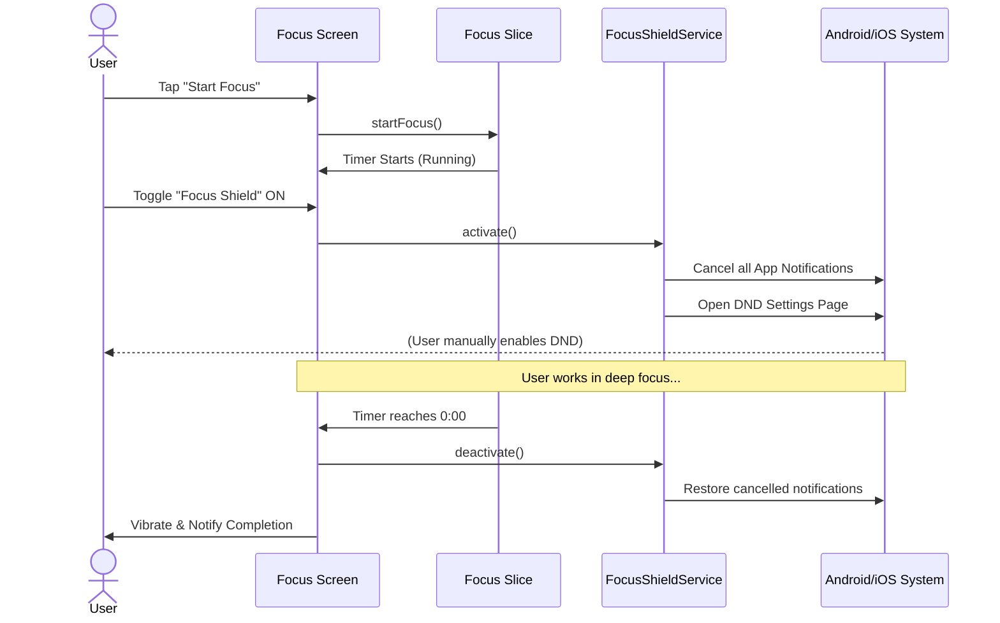
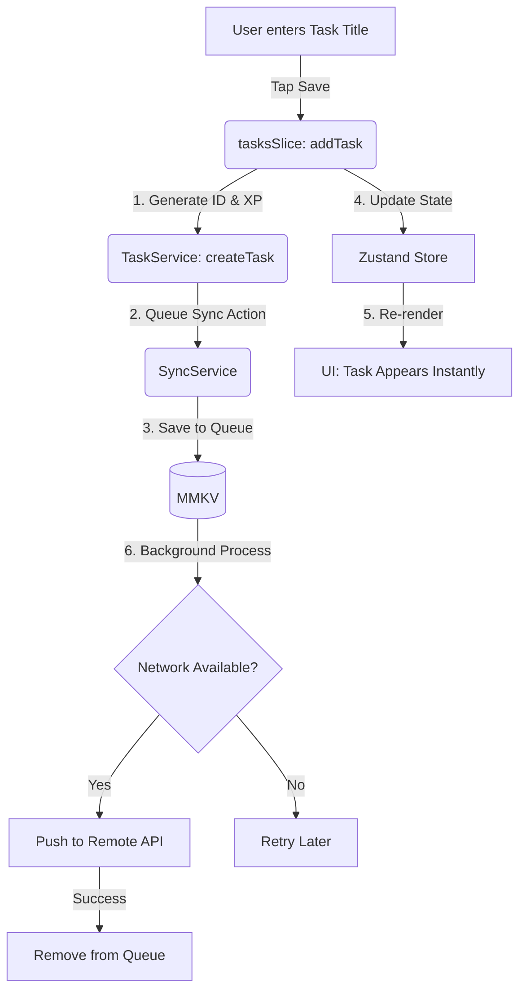

# 🔄 User Flows & Workflows

This page contains visual flowcharts representing key user interactions and system processes within NeuroPilot.

---

## 1. Focus Session & Focus Shield Flow

This diagram illustrates the process of starting a focus session and how the Focus Shield interacts with system settings.

---

## 2. Optimistic Task Creation Flow

This diagram shows how the app achieves zero-latency UI updates while maintaining backend synchronization.

---

[⬅ Back to Home](./README.md)
